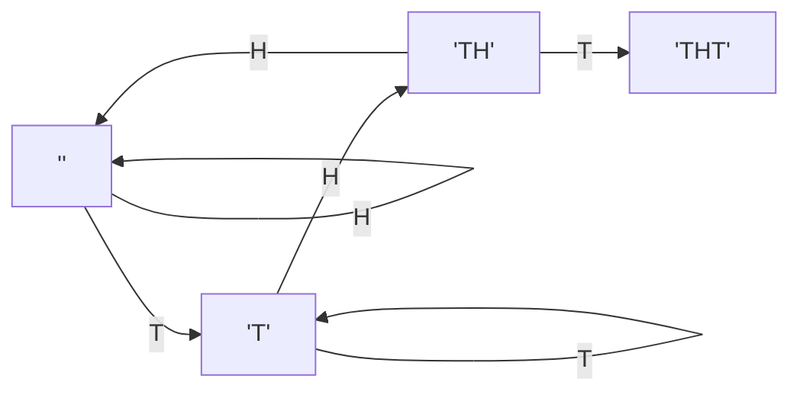
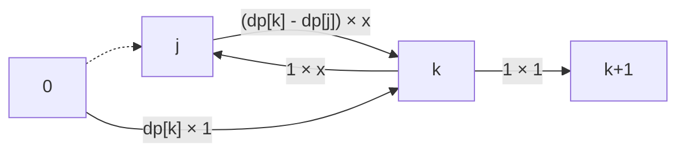

# 典型要素

* KMP法
* 無限級数の計算

# 解法

目標とする文字列の各接頭辞を接点とするグラフを確率的に遷移する問題に帰着する。例えばサンプル3の`THT`では以下のようになる。`'T'`から`'TH'`に遷移するのに失敗した際、`''`でなく`'T'`に遷移することに注意（これはKMP法で計算する）。

ある点にたどり着くまでに投げる回数の期待値は、より短い接頭辞に対応する点から計算できる。例えば、点k+1(長さk+1の接頭辞に対応する点)の値は、以下を用いて計算する。

* 点kの値: `dp[k]`
* 点kから点k+1へ遷移するのに失敗した際に戻る点jの値: `dp[j]`

ここで、点k+1に遷移する全てのありうる方法を、kからk+1への遷移に失敗する回数xで場合分けして列挙する。つまり、`点kまで行き(期待値:dp[k])、x回「jに戻り(期待値:1)、kまで進む(期待値:dp[k]-dp[j])」を繰り返し、k+1に行く(期待値:1)。`と考える。

これをxの値それぞれ(0..∞)について計算し足し合わせれば良い。x=iであるとき、確率は $(1/2)^i * (1/2)$ で、期待値は $dp[k] + i * (1 + dp[k] - dp[j]) + 1$ である。つまり、次の式を計算すればよい。

$$dp[k+1] = \sum_{i=0}^∞ (1/2)^i * (1/2) * (dp[k] + i * (1 + dp[k] - dp[j]) + 1)$$

ここで、無限級数の等式

$$\sum_{i=1}^∞ i / 2^i = 2$$

を用いると、以下のように整理される。

$$dp[k+1] = 2*dp[k] - dp[j] + 2$$

# 備考

無限級数の計算はWolframAlphaが便利。例えば、`\sum_{i=1}^∞ i / 2^i`を[計算してくれる](https://www.wolframalpha.com/input?key=&i=%5Csum_%7Bi%3D1%7D%5E%E2%88%9E+i+%2F+2%5Ei)。

KMP法は、[KMPのK](https://snuke.hatenablog.com/entry/2017/07/18/101026)が分かりやすい。簡潔な説明: `文字列 S が与えられたときに、各 i について「文字列S[0,i-1]の接頭辞と接尾辞が最大何文字一致しているか」を記録した配列を O(|S|)で構築するアルゴリズム`。
